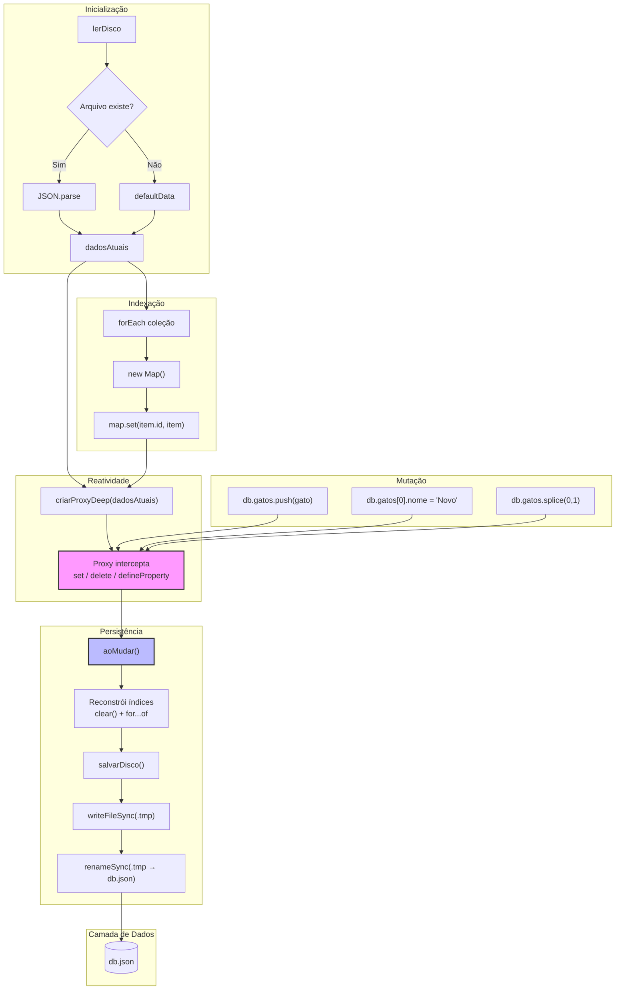

# 🐈 LoRORM — Lord of Reactivity ORM

> Um ORM felino, reativo e em memória. Os dados vivem na RAM, mas se salvam sozinhos em JSON. Rápido como um gato, persistente como a vontade dele de te acordar às 5h da manhã.

---

## Visão Geral

O LoRORM é um "ORM híbrido" que une três ideias simples:

1. **Memória RAM** como camada primária — leitura e escrita instantâneas.
2. **Arquivo JSON** como camada de persistência — salvo automaticamente a cada mutação.
3. **Índices Hash (`Map`)** — buscas por `id` em tempo constante **O(1)**.

A magia está no **Proxy reativo recursivo**: qualquer alteração em qualquer nível do objeto de dados dispara a persistência em disco e a reconstrução dos índices.

---

## Arquitetura Interna

### Diagrama de Fluxo de Dados



---

## Por que funciona?

### 1. O Proxy é recursivo

Quando você lê `db.gatos`, o trap `get` detecta que o valor é um array (objeto) e envolve **ele também** em um Proxy. Quando você lê `db.gatos[0]`, o mesmo acontece com o objeto da entidade. Qualquer alteração em qualquer nível dispara `aoMudar()`.

### 2. A escrita é atômica

O arquivo nunca fica corrompido porque usamos o padrão "write-to-temp-then-rename":

```
1. Grava em db.json.tmp
2. Renomeia db.json.tmp → db.json
```

Em sistemas de arquivo modernos, `rename` é atômico no kernel. Ou o arquivo antigo permanece, ou o novo substitui — nunca um estado intermediário.

### 3. Índices são reconstruídos do zero

A cada mutação, o callback `aoMudar` faz:

```ts
indices[chave].clear();
for (const item of array) {
  indices[chave].set(item.id, item);
}
```

Isso parece custoso, mas para datasets pequenos (até alguns milhares de registros) é **instantâneo** e elimina completamente o risco de desincronização entre array e Map.

### 4. Por que `defineProperty` é essencial

`Array.prototype.splice()` não usa apenas `set` e `deleteProperty`. O algoritmo interno do ECMAScript chama `[[DefineOwnProperty]]` para reconfigurar os índices do array após a remoção. Sem a trap `defineProperty`, o seguinte código quebraria o índice:

```ts
db.gatos.splice(0, 1); // remove o primeiro
db.findById("gatos", idDoSegundo); // null! índice desincronizado
```

A trap captura essa reconfiguração, remove o `id` antigo e adiciona o `id` novo ao Map.

---

## Instalação

```bash
bun add lororm
# ou
npm install lororm
```

---

## Uso Básico

```ts
import { LoRORM } from "lororm";

// 1. Define o esquema
interface Gato {
  id: string;
  nome: string;
  raca: string;
  status: string;
}

type PetShop = {
  gatos: Gato[];
};

// 2. Inicializa
const db = LoRORM<PetShop>({ gatos: [] });

// 3. Insere
db.insert("gatos", {
  id: crypto.randomUUID(),
  nome: "Loro",
  raca: "SRD",
  status: "adotado",
});

// 4. Busca em O(1)
const gato = db.findById("gatos", "046d57bc-af27-4d20-b879-8d715ea81461");

// 5. Atualiza (salva automaticamente)
db.data.gatos[0].nome = "Margot";

// 6. Remove
db.delete("gatos", "046d57bc-af27-4d20-b879-8d715ea81461");
```

---

## API

| Método | Descrição |
|---|---|
| `LoRORM<T>(defaultData)` | Inicializa o banco. Lê `db.json` se existir; senão, usa `defaultData`. |
| `insert(collection, item)` | Adiciona item ao final do array. Dispara persistência. |
| `findById(collection, id)` | Busca por `id` em O(1). Retorna a entidade ou `null`. |
| `update(collection, id, item)` | Substitui a entidade inteira pelo índice no array. |
| `delete(collection, id)` | Remove por `id` com log de sucesso/erro. |
| `deleteOK(collection, id, column)` | Remove comparando qualquer coluna (não apenas `id`). |
| `data` | Acesso direto ao proxy reativo. Permite qualquer operação JavaScript. |

---

## Quando usar (e quando não usar)

| ✅ Use LoRORM | ❌ Não use LoRORM |
|---|---|
| Protótipos e MVPs | Dados financeiros críticos |
| Aplicações single-user | Multi-usuário com concorrência |
| Datasets < 10k registros | Milhões de registros |
| Quando você quer zero config | Quando precisa de ACID completo |
| Quando quer um "banco" que se salva sozinho | Quando precisa de replicação |

---

## Licença

MIT — Use à vontade. Se o banco corromper, a culpa é do gato. 🐱
