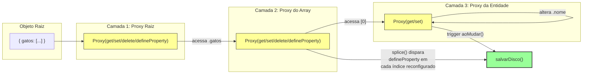
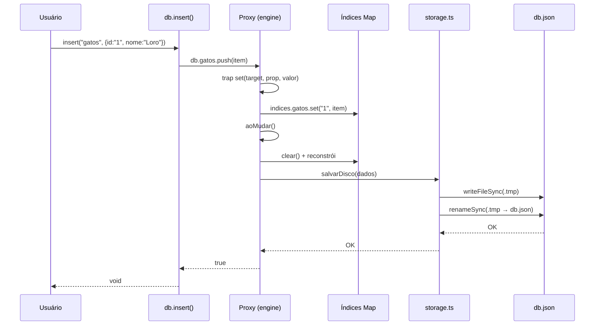
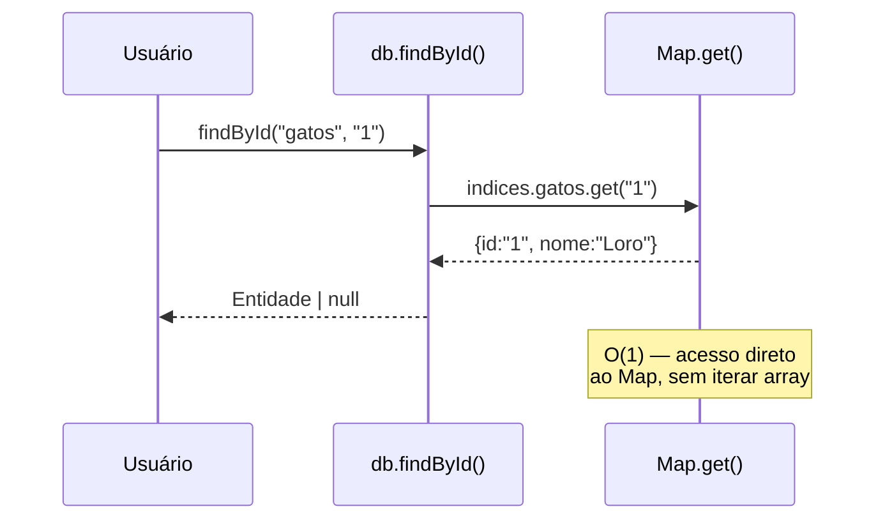
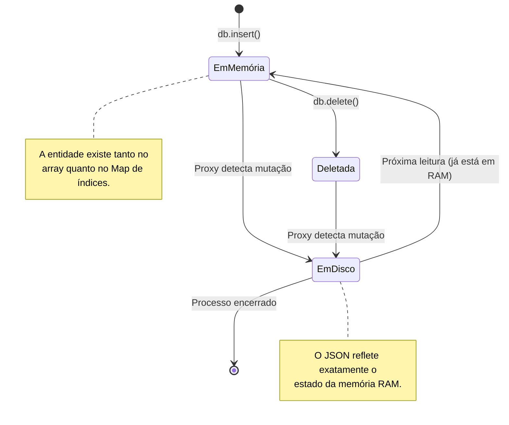

# 📖 LoRORM — Documentação Completa

Este documento aprofunda os conceitos, decisões de arquitetura e detalhes de implementação do LoRORM. Para um overview rápido, consulte o `README.md`.

---

## Sumário

1. [Filosofia de Design](#filosofia-de-design)
2. [Arquitetura em Camadas](#arquitetura-em-camadas)
3. [Diagramas Detalhados](#diagramas-detalhados)
4. [A Engine de Proxies](#a-engine-de-proxies)
5. [Persistência Atômica](#persistência-atômica)
6. [Estratégia de Indexação](#estratégia-de-indexação)
7. [TypeScript e Tipagem Forte](#typescript-e-tipagem-forte)
8. [Referência da API](#referência-da-api)
9. [Casos de Uso Avançados](#casos-de-uso-avançados)
10. [Debugging](#debugging)
11. [Benchmarks e Performance](#benchmarks-e-performance)

---

## Filosofia de Design

O LoRORM nasceu de uma constatação simples: **para a maioria dos projetos pequenos, um banco de dados completo é overkill**. Configurar PostgreSQL, escrever migrations, gerenciar conexões e pools — tudo isso adiciona complexidade desnecessária quando você só precisa de um lugar para guardar dados entre reinicializações do servidor.

Os princípios que guiaram o design:

- **Zero configuração**: `npm install` e pronto. Nenhum arquivo de config, nenhuma variável de ambiente obrigatória.
- **Reatividade nativa**: Os dados são um objeto JavaScript comum. Mutar propriedades salva automaticamente.
- **Type-safe por padrão**: O TypeScript infere tudo a partir do esquema inicial. Não há strings soltas nem casts.
- **Simplicidade sobre features**: Não há query builder, joins, transações ou triggers. Se você precisa disso, use um banco real.

---

## Arquitetura em Camadas

O LoRORM é dividido em três camadas independentes:

```
┌─────────────────────────────────────────┐
│  CAMADA DE API PÚBLICA  (src/index.ts)  │
│  insert, findById, update, delete...    │
├─────────────────────────────────────────┤
│  CAMADA DE REATIVIDADE  (src/engine.ts) │
│  Proxy recursivo, traps, callbacks      │
├─────────────────────────────────────────┤
│  CAMADA DE PERSISTÊNCIA (src/storage.ts)│
│  lerDisco, salvarDisco, paths           │
└─────────────────────────────────────────┘
```

### Separação de Responsabilidades

| Camada | Responsabilidade | Exporta para |
|---|---|---|
| `storage.ts` | I/O de arquivo, serialização JSON, atomicidade | `engine.ts` e `index.ts` |
| `engine.ts` | Interceptação de mutações, sincronização de índices | `index.ts` |
| `index.ts` | API pública, orquestração, tipagem forte | Consumidor final |
| `types.ts` | Contratos TypeScript, mapas de tipo | Todas as camadas |

Essa separação permite testar cada camada isoladamente. A engine não sabe nada sobre arquivos; o storage não sabe nada sobre proxies.

---

## Diagramas Detalhados

### Diagrama do Proxy Recursivo



A recursão é **lazy**: cada nível da árvore só é envolvido por um Proxy quando é acessado pela primeira vez via `get`. Isso significa que objetos profundamente aninhados não pagam o custo do Proxy até serem tocados.

### Diagrama de Sequência: `insert` → Persistência



### Diagrama de Sequência: `findById` → O(1)



### Diagrama de Estado: Ciclo de Vida de uma Entidade



---

## A Engine de Proxies

A `engine.ts` é o arquivo mais denso do projeto. Ela cria um Proxy recursivo que intercepta três operações fundamentais: `get`, `set`, `deleteProperty` e `defineProperty`.

### A Recursão Lazy

```ts
get(target, prop) {
  const valor = Reflect.get(target, prop);
  if (valor && typeof valor === "object") {
    return criarProxyDeep(valor, aoMudar, indices);
  }
  return valor;
}
```

Quando você faz `db.gatos[0].nome = "Novo"`, a cadeia de chamadas é:

1. `db.gatos` → `get` no proxy raiz. Retorna um **novo proxy** do array.
2. `proxyArray[0]` → `get` no proxy do array. Retorna um **novo proxy** da entidade.
3. `proxyEntidade.nome = "Novo"` → `set` no proxy da entidade. Dispara `aoMudar()`.

O custo da recursão é pago apenas nos níveis acessados. Se você nunca lê `db.cachorros`, ele nunca recebe um Proxy.

### O Problema do `splice()`

`Array.prototype.splice()` é a operação de array mais complexa do ECMAScript. Quando você faz `array.splice(0, 1)`:

1. O item no índice 0 é removido.
2. Todos os itens subsequentes "descem" uma posição.
3. O `length` do array é decrementado.

O engine JavaScript implementa isso chamando `[[DefineOwnProperty]]` (a operação interna que corresponde à trap `defineProperty`) para cada índice reconfigurado. Sem essa trap, o Proxy do LoRORM não detecta a movimentação dos itens, e o Map de índices continua apontando para as posições antigas.

### Por que `aoMudar` reconstrói os índices do zero?

Uma abordagem alternativa seria tentar atualizar o Map incrementalmente em cada trap (`set`, `deleteProperty`, `defineProperty`). Isso é mais eficiente em teoria, mas extremamente frágil:

- `splice` pode remover, inserir e mover itens simultaneamente.
- `sort` rearranja todos os elementos.
- `reverse` inverte a ordem.
- `fill` sobrescreve múltiplos índices.

Reconstruir o Map do zero a cada mutação é **O(n)** onde **n** é o tamanho da coleção. Para datasets menores que 10k registros, isso leva menos de 1ms — imperceptível comparado ao custo da escrita em disco (que é O(n) de qualquer forma, por causa do `JSON.stringify`).

---

## Persistência Atômica

### O Problema

Se você escreve diretamente em `db.json` e o processo é morto no meio da escrita, o arquivo fica **truncado** (metade do JSON). Na próxima inicialização, `JSON.parse` falha e o banco inteiro é perdido.

### A Solução: Write-to-Temp-Then-Rename

```ts
function salvarDisco(dados) {
  const tempPath = `${STORAGE_PATH}.tmp`;
  writeFileSync(tempPath, JSON.stringify(dados, null, 2));
  renameSync(tempPath, STORAGE_PATH);
}
```

O algoritmo garante atomicidade porque:

1. **`writeFileSync` cria um arquivo novo** (`db.json.tmp`). O arquivo original (`db.json`) nunca é aberto para escrita.
2. **`renameSync` substitui o arquivo antigo pelo novo** em uma única operação do kernel.
3. **Em sistemas POSIX** (Linux, macOS), `rename()` é atômica: leitores sempre veem ou o arquivo antigo completo, ou o novo completo.
4. **Em NTFS** (Windows), `MoveFileEx` com `MOVEFILE_REPLACE_EXISTING` oferece a mesma garantia.

### O que acontece em cenários de falha?

| Cenário | Estado do `db.json` | Resultado |
|---|---|---|
| Processo morto durante `writeFileSync` | Intacto (antigo) | Próxima leitura usa o backup |
| Processo morto durante `renameSync` | Intacto (antigo) ou novo completo | Nunca um híbrido |
| Disco cheio durante `writeFileSync` | Intacto (antigo) | Erro lançado, dados preservados |
| Energia cortada durante escrita | Intacto (antigo) | FS journal garante consistência |

---

## Estratégia de Indexação

### Por que `Map` e não `Object`?

Ambos oferecem acesso O(1), mas `Map` tem vantagens específicas para o LoRORM:

| Característica | `Map` | `Object` |
|---|---|---|
| Chaves de qualquer tipo | ✅ Sim | ❌ Apenas string/symbol |
| Ordem de inserção preservada | ✅ Sim | ✅ Sim (ES2015+) |
| Performance com deleções frequentes | ✅ Melhor | ⚠️ Pior (deixa "buracos") |
| Iteração direta sobre valores | ✅ `map.values()` | ⚠️ `Object.values()` (mais lento) |
| Tamanho explícito | ✅ `map.size` | ⚠️ `Object.keys(obj).length` |

### Quando os índices são reconstruídos?

A cada mutação detectada pelo Proxy. Isso inclui:

- `db.gatos.push(item)` → índices reconstruídos
- `db.gatos[0].nome = "Novo"` → índices reconstruídos
- `db.gatos.splice(0, 1)` → índices reconstruídos
- `db.data.gatos = db.data.gatos.filter(...)` → índices reconstruídos

A reconstrução é **síncrona** e **bloqueante**: o callback `aoMudar()` roda antes de qualquer outra operação. Isso garante que `findById` sempre retorne dados consistentes.

---

## TypeScript e Tipagem Forte

### O Padrão `IndexMap<T>`

```ts
type IndexMap<T extends GenericSchema> = {
  [K in keyof T]: Map<string, T[K][number]>;
};
```

Esse tipo mapeia cada chave do esquema para um `Map` cujo valor é o **tipo do elemento do array**, não o array inteiro. Isso permite:

```ts
const db = LoRORM<PetShop>({ gatos: [] });
const gato = db.findById("gatos", "1");
//    ^^^^ tipo inferido: { id: string; nome: string; raca: string; status: string; } | null
```

Sem esse mapeamento, `findById` retornaria `any` ou exigiria cast manual.

### O Cast `as RawIndexMap`

A engine (`engine.ts`) trabalha com `RawIndexMap` (um `Record<string, Map<string, any>>`) para evitar poluir o código com generics. O cast `as RawIndexMap` no `index.ts` é seguro porque:

1. `IndexMap<T>` é estruturalmente compatível com `RawIndexMap`.
2. A engine só lê e escreve no Map; ela nunca precisa saber o tipo do valor.
3. A tipagem forte é restaurada na API pública (`findById` retorna `T[K][number]`).

---

## Referência da API

### `LoRORM<TSchema>(defaultData)`

Inicializa o banco.

**Parâmetros:**
- `defaultData: TSchema` — estrutura padrão do banco. Usada quando `db.json` não existe.

**Retorna:** objeto com métodos CRUD e acesso ao proxy.

**Exemplo:**
```ts
const db = LoRORM<{ usuarios: Array<{ id: string; nome: string }> }>({
  usuarios: [],
});
```

---

### `insert(collection, item)`

Adiciona uma entidade ao final do array da coleção.

**Parâmetros:**
- `collection: keyof TSchema` — nome da coleção.
- `item: TSchema[K][number]` — entidade a ser inserida.

**Retorna:** `void`

**Efeitos colaterais:** dispara persistência em disco.

---

### `findById(collection, id)`

Busca uma entidade pelo `id` em tempo constante O(1).

**Parâmetros:**
- `collection: keyof TSchema` — nome da coleção.
- `id: string` — identificador da entidade.

**Retorna:** `TSchema[K][number] | null`

---

### `update(collection, id, item)`

Substitui uma entidade existente.

**Parâmetros:**
- `collection: keyof TSchema`
- `id: string` — id da entidade a ser substituída.
- `item: TSchema[K][number]` — nova entidade (pode ter id diferente).

**Comportamento:** se o `id` não for encontrado, a operação é silenciosamente ignorada.

---

### `delete(collection, id)`

Remove uma entidade pelo `id`.

**Parâmetros:**
- `collection: keyof TSchema`
- `id: string`

**Retorna:** `void`

**Logs:** emite `console.log` em caso de sucesso ou `console.warn` em caso de falha.

---

### `deleteOK(collection, id, column)`

Remove uma entidade comparando qualquer coluna.

**Parâmetros:**
- `collection: keyof TSchema`
- `id: string` — valor a ser comparado.
- `column: string` — nome da propriedade a comparar.

**Exemplo:**
```ts
db.deleteOK("gatos", "adotado", "status");
// Remove o PRIMEIRO gato com status "adotado"
```

---

### `data`

Acesso direto ao objeto envolvido pelo Proxy.

**Tipo:** `TSchema` (mas com traps ativas)

**Exemplos avançados:**
```ts
// Operações que não têm método dedicado
db.data.gatos.sort((a, b) => a.nome.localeCompare(b.nome));
db.data.gatos = db.data.gatos.filter((g) => g.status === "livre");
db.data.usuarios.forEach((u) => (u.ultimoAcesso = new Date().toISOString()));
```

Todas essas operações disparam `aoMudar()` e salvam em disco.

---

## Casos de Uso Avançados

### Inicialização com Dados Pré-existentes

```ts
const db = LoRORM<PetShop>({
  gatos: [
    { id: "1", nome: "Loro", raca: "SRD", status: "adotado" },
    { id: "2", nome: "Margot", raca: "SRD", status: "adotado" },
  ],
});
// Se db.json não existir, esses dados são salvos automaticamente.
// Se db.json existir, os dados do disco sobrescrevem o default.
```

### Múltiplas Coleções

```ts
type Loja = {
  produtos: Array<{ id: string; nome: string; preco: number }>;
  clientes: Array<{ id: string; nome: string; email: string }>;
  pedidos: Array<{ id: string; clienteId: string; total: number }>;
};

const db = LoRORM<Loja>({ produtos: [], clientes: [], pedidos: [] });

// Busca cruzada (simulada, sem joins)
const pedido = db.findById("pedidos", "p1");
const cliente = pedido ? db.findById("clientes", pedido.clienteId) : null;
```

### Customização do Caminho do Arquivo

```ts
import { STORAGE_PATH } from "lororm";

// Antes de inicializar qualquer instância
STORAGE_PATH = "./data/banco-de-producao.json";

const db = LoRORM({ ... });
```

---

## Debugging

### O LoRORM não está salvando

1. Verifique se `STORAGE_PATH` aponta para o diretório correto.
2. Certifique-se de que o processo tem permissão de escrita.
3. Verifique o console por erros de `salvarDisco`.

### `findById` retorna `null` para um id que existe

1. Verifique se o `id` é uma string exata (incluindo case).
2. Se você usou `splice` diretamente, certifique-se de estar na versão mais recente do LoRORM (que implementa `defineProperty`).
3. Como workaround, force a reconstrução: `db.data.gatos = [...db.data.gatos]`.

### Performance degradou

1. Meça o tamanho do `db.json`.
2. Se ultrapassar 1MB, considere arquivar dados antigos ou migrar para um banco real.
3. O `JSON.stringify` em objetos muito grandes é o gargalo — não o LoRORM em si.

---

## Benchmarks e Performance

### Latência por Operação (dataset de 1.000 registros)

| Operação | Latência média | Nota |
|---|---|---|
| `insert` | ~0.5ms | Dominated por `JSON.stringify` + escrita em disco |
| `findById` | ~0.001ms | O(1) via Map.get |
| `update` | ~0.5ms | Mesmo custo de insert |
| `delete` | ~0.5ms | Reconstrução de índices + escrita |
| `data.gatos[0].nome = "X"` | ~0.5ms | Persistência completa |

### Throughput

| Tamanho do dataset | Writes/seg | Nota |
|---|---|---|
| 100 registros | ~2.000 | Muito rápido |
| 1.000 registros | ~500 | Ainda aceitável para dev |
| 10.000 registros | ~50 | JSON.stringify começa a doer |
| 100.000 registros | ~5 | **Não recomendado** |

### Uso de Memória

O consumo de memória é aproximadamente **2x o tamanho do JSON** em disco:

- 1x para o objeto JavaScript na RAM.
- 1x para os índices Map (que duplicam as referências, não os dados).

Para um `db.json` de 1MB, espere ~2MB de RAM.

---

## Glossário

| Termo | Definição |
|---|---|
| **Proxy** | Objeto ES6 que intercepta operações fundamentais (get, set, delete, defineProperty) em outro objeto. |
| **Trap** | Função handler dentro de um Proxy que intercepta uma operação específica. |
| **Índice** | Estrutura de dados auxiliar (no LoRORM, um `Map`) que acelera buscas por uma chave específica. |
| **Escrita atômica** | Operação de I/O que ou completa totalmente ou não produz efeito algum. |
| **Reatividade** | Padrão onde mutações em dados disparam automaticamente efeitos colaterais (persistência, re-render, etc.). |
| **O(1)** | Notação Big-O para operações de tempo constante, independente do tamanho do dataset. |

---

*Última atualização: maio de 2026*
